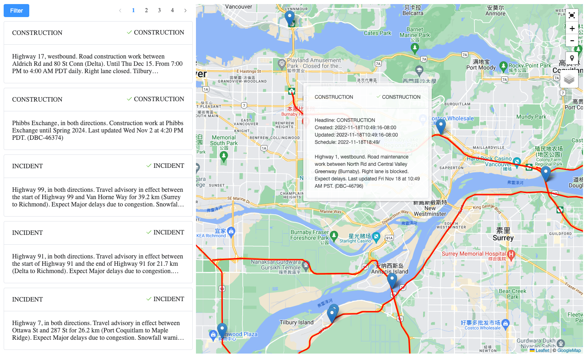

## Written Assignment Phase Req#92534 ISL 27R – Full Stack Developer

### Download

`git clone https://github.com/dongyg/req92534.git`

### Run

Please prepare a Linux with `docker` and `docker-compose` environment.

Running this web application will create a virtual docker environment as a docker container on your host docker.

```sh
# Build
cd req92534 && ./1_build.sh

# Run
./2_run.sh
```

### Using

After the docker containers are up, please open a browser and access `http://localhost:8027`. The web page should be like this



### Clean

After all done, just run `3_clear.sh` to clean up your host environment. Plus remove the folder `req92534`

### Thank you!
